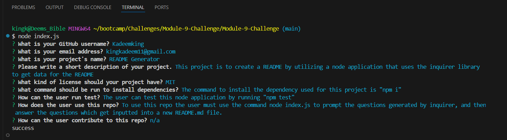

# Professional README Generator

## Description

I wanted to build a README generator to make it easier and faster for project creators to create a README for their project. THis will allow them to save time on creating a README from scratch giving them more time to work on their project. Creating this project helped me understand how to use certain functions in node, how to interact with the file system to append information created in one file to another, as well as how to download and use node libraries such as inquirer. Using the inquirer library I was able to create questions to help the user fill out their README before appending it to a README.md file.

## Table of Contents

If your README is long, add a table of contents to make it easy for users to find what they need.

- [Installation](#installation)
- [Usage](#usage)
- [Credits](#credits)
- [License](#license)

## Installation

Use npm i to download the dependencies.

## Usage

To use my node application you first have to input "node index.js" in the terminal to run it. You will then be prompted with questions that will gather the information to build your README. Once answering all the questions, the answers will be appeneded to a new README file.

## Credits

<a href="https://coding-boot-camp.github.io/full-stack/github/professional-readme-guide">README Format</a> 

<a href="https://gist.github.com/lukas-h/2a5d00690736b4c3a7ba">License Page</a> 

## License

